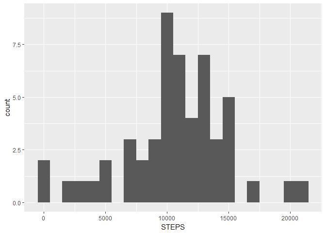
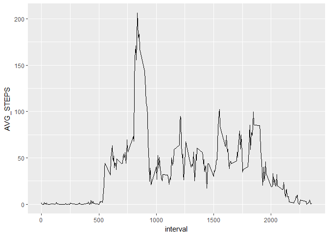
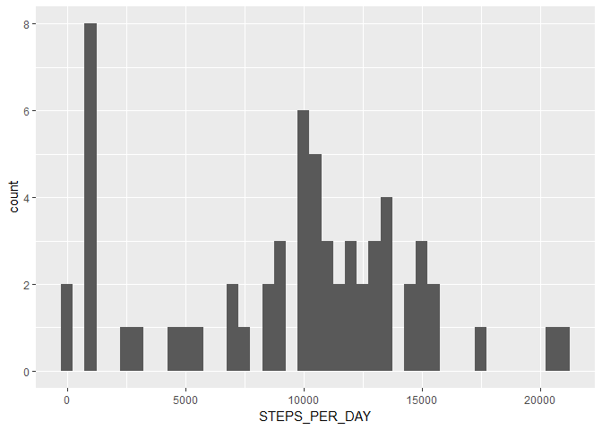
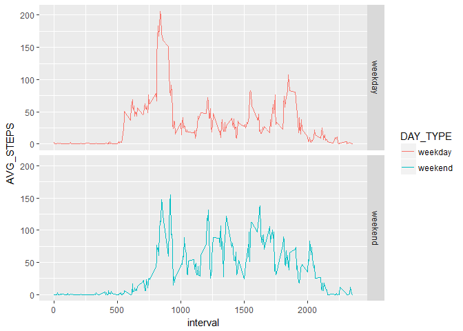

# assign_1
Mathieu Jones  
28 August 2017  


## Libraries


```r
library(data.table); library(ggplot2)
```


## Import data


```r
# data is saved in "data" folder of 'here_loc' directory
dat <- fread(paste(here_loc,"data","activity.csv",sep="/"))
print(dat[1:5])
```

```
##    steps       date interval
## 1:    NA 2012-10-01        0
## 2:    NA 2012-10-01        5
## 3:    NA 2012-10-01       10
## 4:    NA 2012-10-01       15
## 5:    NA 2012-10-01       20
```

```r
str(dat)
```

```
## Classes 'data.table' and 'data.frame':	17568 obs. of  3 variables:
##  $ steps   : int  NA NA NA NA NA NA NA NA NA NA ...
##  $ date    : chr  "2012-10-01" "2012-10-01" "2012-10-01" "2012-10-01" ...
##  $ interval: int  0 5 10 15 20 25 30 35 40 45 ...
##  - attr(*, ".internal.selfref")=<externalptr>
```


## Per-day analysis

```r
per_day<-dat[,.(STEPS=sum(steps),na.rm=T),date]
per_day[,.(MEAN_STEPS=mean(STEPS,na.rm=T),MEDIAN_STEPS=median(STEPS,na.rm=T))]
```

```
##    MEAN_STEPS MEDIAN_STEPS
## 1:   10766.19        10765
```

```r
ggplot(data=per_day,aes(x=STEPS))+geom_histogram(binwidth = 1000)
```

```
## Warning: Removed 8 rows containing non-finite values (stat_bin).
```

<!-- -->

## Per-5min analysis


```r
per5 <- dat[,.(AVG_STEPS=mean(steps,na.rm=T)),interval]
ggplot(data=per5,aes(y=AVG_STEPS,x=interval))+geom_line()
```

<!-- -->

```r
#max no steps:
per5[AVG_STEPS==per5[,max(AVG_STEPS)]]
```

```
##    interval AVG_STEPS
## 1:      835  206.1698
```


## Imputing NAs


```r
dat[,.(count=.N),.(Missing=is.na(steps))]
```

```
##    Missing count
## 1:    TRUE  2304
## 2:   FALSE 15264
```

```r
#impute NA by 5 minute interval
dat_imputed <- copy(dat)
dat_imputed[, steps := replace(steps, is.na(steps), median(steps, na.rm=T)), by=.(interval)]

per_date_imputed <- dat_imputed[,.(STEPS_PER_DAY=sum(steps)),date]

ggplot(data=per_date_imputed,aes(x=STEPS_PER_DAY))+geom_histogram(binwidth = 500)
```

<!-- -->

```r
rbind(per_date_imputed[,.(NAs = "Imputed",MEAN_STEPS=mean(STEPS_PER_DAY), MEDIAN_STEPS=median(STEPS_PER_DAY))],
per_day[,.(NAs = "Original",MEAN_STEPS=mean(STEPS,na.rm=T),MEDIAN_STEPS=median(STEPS,na.rm=T))])
```

```
##         NAs MEAN_STEPS MEDIAN_STEPS
## 1:  Imputed   9503.869        10395
## 2: Original  10766.189        10765
```

```r
#imputing reduces the mean and the median total steps per day estimate
```

## Weekdays vs Weekends


```r
dat_imputed[,DAY_TYPE:=ifelse(weekdays(as.Date(date)) %in% c("Sunday","Saturday"),"weekend","weekday")]
dat_imputed[,.N,.(weekdays(as.Date(date)),DAY_TYPE)]
```

```
##     weekdays DAY_TYPE    N
## 1:    Monday  weekday 2592
## 2:   Tuesday  weekday 2592
## 3: Wednesday  weekday 2592
## 4:  Thursday  weekday 2592
## 5:    Friday  weekday 2592
## 6:  Saturday  weekend 2304
## 7:    Sunday  weekend 2304
```

```r
ggplot(data=dat_imputed[,.(AVG_STEPS=mean(steps)),.(interval,DAY_TYPE)], aes(x=interval, y=AVG_STEPS,group=DAY_TYPE)) + geom_line(aes(colour=DAY_TYPE))+
    facet_grid(DAY_TYPE~.)
```

<!-- -->
